# Riepilogo Completo Sistema di Trade - Tharidia Things

## 📋 Panoramica Generale

Sistema di trade completo tra giocatori con:
- ✅ Conferma a due stadi
- ✅ Sistema di tassazione configurabile
- ✅ Protezione completa contro perdita item
- ✅ Blocco movimento e azioni durante trade
- ✅ Visualizzazione tasse in tempo reale
- ✅ Protezione item di valuta

## 🎯 Funzionalità Principali

### 1. **Iniziare un Trade**
- Click destro su un altro giocatore **tenendo in mano un item di valuta**
- Item di valuta configurabili in `tradeCurrencyItems` (default: patate)
- Il giocatore target riceve una richiesta
- Se accetta, si apre il menu di trade per entrambi

### 2. **Menu di Trade**
- **24 slot** per giocatore (6 righe x 4 colonne)
- Visualizzazione item dell'altro giocatore (lato destro)
- Inventario personale in basso
- Pulsanti di controllo al centro

### 3. **Sistema a Due Stadi**

#### **Stadio 1: Conferma Iniziale**
- Inserisci item negli slot
- Premi "§6§l⚜ Conferma ⚜"
- **Effetti:**
  - Slot bloccati (non puoi più modificare)
  - L'altro giocatore vede i tuoi item
  - Appare "§2✓ Confermato" sotto il tuo nome

#### **Stadio 2: Conferma Finale**
- Quando **entrambi** hanno confermato
- Appare pulsante "§a§l✓ CONFERMA FINALE"
- Visualizzazione tasse:
  - "§cTassa: 10% (-X)"
  - "§aRiceverai: Y"
- Entrambi devono premere "CONFERMA FINALE"
- Trade completato!

### 4. **Sistema di Tassazione**

#### **Configurazione**
```toml
# File: tharidiathings-common.toml

# Item considerati valuta (soggetti a tassa)
tradeCurrencyItems = ["minecraft:potato", "minecraft:gold_nugget"]

# Percentuale tassa (0.1 = 10%)
tradeTaxRate = 0.1
```

#### **Applicazione**
- Tassa applicata **solo agli item di valuta**
- Altri item non sono tassati
- Calcolo: `ricevuto = originale * (1 - taxRate)`
- Esempio: 100 patate → ricevi 90 patate (10% tassa)

#### **Visualizzazione**
- Mostrata in tempo reale sulla GUI
- Posizione: centro del menu
- Colori:
  - Rosso per la tassa
  - Verde per l'importo ricevuto

### 5. **Protezione Item di Valuta**

Gli item configurati in `tradeCurrencyItems` hanno protezioni speciali:

#### **Non Possono:**
- ❌ Essere droppati a terra (tasto Q)
- ❌ Essere messi in chest, barrel, hopper, ecc.
- ❌ Essere messi in qualsiasi container esterno

#### **Possono:**
- ✅ Stare nell'inventario del giocatore
- ✅ Essere usati nel menu di trade
- ✅ Essere scambiati tra giocatori

#### **Recupero Automatico:**
- Se finiscono a terra → recuperati dal giocatore più vicino
- Se messi in container → rimossi e restituiti
- Messaggio: "§eItem di valuta recuperato automaticamente"

## 🔒 Restrizioni Durante Trade

### **Completamente Bloccato:**
1. **Movimento**
   - Non puoi muoverti in nessuna direzione
   - Gravità funziona normalmente
   - Implementato in `TradeInventoryBlocker.onEntityTick()`

2. **Apertura Inventario**
   - Tasto E bloccato
   - Impossibile aprire inventario personale
   - Implementato in `TradeScreen.keyPressed()`

3. **Chiusura Menu**
   - Tasto ESC bloccato
   - `onClose()` override vuoto
   - Unico modo: pulsante "Annulla"

4. **Apertura Altri Container**
   - Chest, barrel, ecc. bloccati
   - Messaggio: "§cNon puoi aprire l'inventario durante uno scambio!"

5. **Modifica Item Post-Conferma**
   - Slot bloccati dopo conferma
   - Shift-click disabilitato
   - Drag & drop disabilitato

### **Permesso:**
- ✅ Annullare il trade (pulsante "§c✗ Annulla")
- ✅ Annullare la conferma (prima della conferma finale)
- ✅ Guardare gli item dell'altro giocatore

## 🛡️ Protezione Perdita Item

### **Garanzie:**
1. **Chiusura Anomala**
   - Crash del gioco
   - Disconnessione
   - Comando /kill
   - → Item **sempre restituiti** all'inventario

2. **Cancellazione Trade**
   - Pulsante "Annulla"
   - Altro giocatore annulla
   - Timeout sessione
   - → Item **sempre restituiti**

3. **Inventario Pieno**
   - Se inventario pieno durante restituzione
   - → Item droppati ai piedi del giocatore
   - Nessun item perso

### **Implementazione:**
```java
// In TradeMenu.removed()
@Override
public void removed(Player player) {
    if (!player.level().isClientSide) {
        for (ItemStack stack : playerOffer) {
            if (!player.getInventory().add(stack)) {
                player.drop(stack, false); // Fallback
            }
        }
    }
}
```

## 📊 Flusso Completo Trade

```mermaid
graph TD
    A[Giocatore A click destro su B con valuta] --> B[B riceve richiesta]
    B --> C{B accetta?}
    C -->|No| D[Fine]
    C -->|Sì| E[Menu aperto per entrambi]
    E --> F[Entrambi bloccati: NO movimento, NO inventario]
    F --> G[Inseriscono item negli slot]
    G --> H[A preme Conferma]
    H --> I[Slot A bloccati, B vede item di A]
    I --> J[B preme Conferma]
    J --> K[Slot B bloccati, A vede item di B]
    K --> L[Appare CONFERMA FINALE per entrambi]
    L --> M[Visualizzazione tasse]
    M --> N[A preme CONFERMA FINALE]
    N --> O[B preme CONFERMA FINALE]
    O --> P[Trade completato!]
    P --> Q[Item scambiati con tassa applicata]
    Q --> R[Menu chiuso, giocatori sbloccati]
```



## 🎮 Comandi Admin

### `/trade reset <player>`
Resetta il trade di un singolo giocatore
- Cancella la sessione attiva
- Chiude il menu
- Restituisce gli item
- Richiede OP level 2

### `/trade resetbetween <player1> <player2>`
Resetta il trade tra due giocatori specifici
- Cancella entrambe le sessioni
- Chiude entrambi i menu
- Restituisce gli item a entrambi
- Richiede OP level 2

## 📁 Struttura File

### **Core Trade System**
- `TradeManager.java` - Gestione sessioni
- `TradeSession.java` - Dati sessione singola
- `TradeMenu.java` - Menu container (server)
- `TradeScreen.java` - GUI (client)

### **Network Packets**
- `TradeRequestPacket.java` - Richiesta trade
- `TradeResponsePacket.java` - Risposta (accetta/rifiuta)
- `TradeUpdatePacket.java` - Aggiornamento item
- `TradeFinalConfirmPacket.java` - Conferma finale
- `TradeCancelPacket.java` - Cancellazione
- `TradeCompletePacket.java` - Completamento

### **Event Handlers**
- `TradeInteractionHandler.java` - Click destro per iniziare
- `TradeInventoryBlocker.java` - Blocco inventario e movimento
- `CurrencyProtectionHandler.java` - Protezione item valuta
- `TradePacketHandler.java` - Gestione pacchetti server

### **Commands**
- `TradeCommands.java` - Comandi admin

### **Configuration**
- `Config.java` - Parametri configurabili

## ⚙️ Configurazione

### **File:** `config/tharidiathings-common.toml`

```toml
# Lista item valuta (possono iniziare trade e sono tassati)
tradeCurrencyItems = ["minecraft:potato", "minecraft:gold_nugget"]

# Percentuale tassa (0.0 = 0%, 1.0 = 100%)
tradeTaxRate = 0.1

# Altri parametri...
```

## 🐛 Troubleshooting

### **Problema:** Giocatori bloccati in trade
**Soluzione:** `/trade reset <player>` o `/trade resetbetween <p1> <p2>`

### **Problema:** Item persi durante trade
**Soluzione:** Impossibile - sistema garantisce restituzione

### **Problema:** Non riesco a chiudere il menu
**Soluzione:** Usa il pulsante "Annulla" - ESC è bloccato intenzionalmente

### **Problema:** Non vedo le tasse
**Soluzione:** Le tasse appaiono solo quando l'altro giocatore conferma

### **Problema:** Item di valuta in chest
**Soluzione:** Vengono automaticamente rimossi e restituiti

## 📈 Performance

### **Ottimizzazioni Implementate:**
1. **Controllo Container:** Ogni 10 tick invece di ogni tick (-90% carico)
2. **Controllo Item a Terra:** Solo per ItemEntity specifiche
3. **Range Limitato:** Recupero automatico solo entro 5 blocchi
4. **Skip Intelligente:** Salta slot inventario giocatore nei controlli
5. **Calcolo Tasse:** Solo quando necessario (visualizzazione)

### **Impatto Server:**
- Minimo durante trade normale
- Controlli tick ottimizzati
- Nessun lag percepibile

## ✅ Checklist Funzionalità

- [x] Iniziare trade con click destro + item valuta
- [x] Menu trade con 24 slot per giocatore
- [x] Conferma a due stadi
- [x] Blocco movimento durante trade
- [x] Blocco inventario durante trade
- [x] Blocco chiusura menu (solo pulsante Annulla)
- [x] Blocco modifica item post-conferma
- [x] Visualizzazione tasse in tempo reale
- [x] Applicazione tasse su item valuta
- [x] Protezione item valuta (no drop, no container)
- [x] Recupero automatico item valuta a terra
- [x] Restituzione garantita item alla chiusura
- [x] Comandi admin per reset trade
- [x] Configurazione tasse e item valuta
- [x] Integrazione con MarketBridge
- [x] Sincronizzazione client-server
- [x] Gestione disconnessioni
- [x] Gestione crash
- [x] Messaggi informativi ai giocatori

## 🎓 Best Practices

### **Per Giocatori:**
1. Verifica sempre gli item prima della conferma finale
2. Controlla la quantità dopo le tasse
3. Usa il pulsante "Annulla" se cambi idea
4. Non tentare di chiudere con ESC (è bloccato)

### **Per Admin:**
1. Configura `tradeCurrencyItems` in base all'economia del server
2. Regola `tradeTaxRate` per bilanciare l'economia
3. Usa `/trade reset` solo in caso di emergenza
4. Monitora i log per trade sospetti

### **Per Developer:**
1. Tutti i controlli sono server-side per sicurezza
2. Client riceve solo dati necessari
3. Nessuna fiducia nel client
4. Validazione completa server-side
